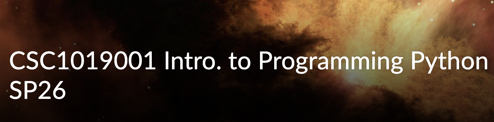

# CSC 1019: Introduction to Programming – Python

Coursework repository for CSC 1019 at CCD, using zyBooks as the learning platform.
All assignments, labs, and projects from this course will be stored here.

## 📚 Topics Covered
1. Introduction to Python
2. Variables and Expressions
3. Types
4. Branching
5. Loops
6. Functions
7. Strings
8. Lists and Dictionaries
9. Classes
10. Exceptions
11. Modules
12. Files
13. Inheritance
14. Recursion
15. Python for Data Science
16. Searching and Sorting Algorithms

## 📁 Repository Structure
- `assignments/` – zyBooks chapter assignments
- `labs/` – zyLabs exercises
- `projects/` – Larger course projects

## 🛠 Tools & Environment
- Language: Python 3
- Platform: zyBooks (CSC1019 Spring 2026)
- Editor: VS Code

## 👤 Author
Diyor R – CCD Spring 2026
